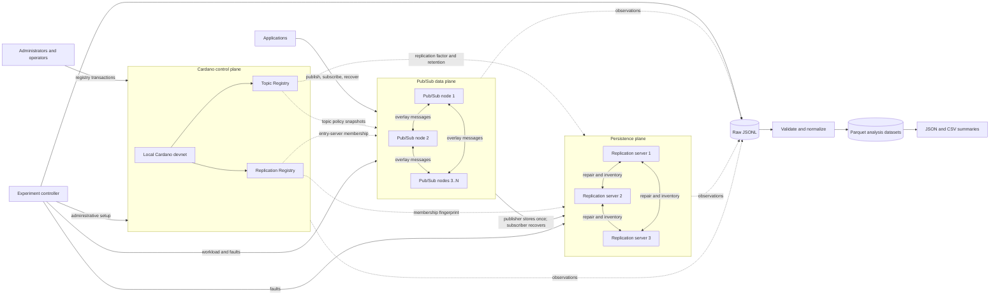
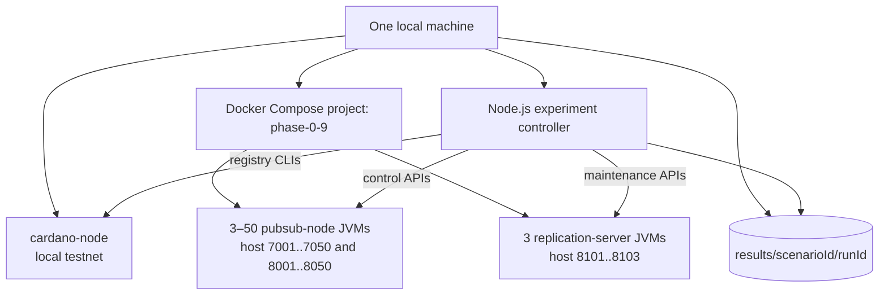

# D1 — Overall system architecture

This diagram introduces the four logical planes. It is the best starting point
for a developer who needs to understand component boundaries before looking at
protocol details.

## How to read D1

Start in the center with the Pub/Sub data plane. Nodes exchange live events over
their peer overlay. The original publisher also submits each accepted event to
one replication entry server; receiving peers do not independently persist the
same event. The entry server calculates which servers should hold the replicas.

The Cardano plane changes much less frequently. Topic rules and replication
membership are materialized as local snapshots that runtimes poll. The dashed
arrows therefore mean “observe current configuration,” not that every event is
written to or read from the chain.

The experiment controller is outside the application architecture. It creates
test topics, drives APIs, injects faults, and collects observations. JSONL is the
authoritative record of what happened; Parquet is its validated, analysis-ready
representation.

## Local deployment

This second diagram maps the logical system to one physical development machine.
It explains where processes run and which host ports a person or script can use.

## How to read the deployment diagram

Everything runs on one host; Docker provides process and storage isolation, not
a multi-host network. Each Pub/Sub container exposes peer transport on the 7000
series and a local control API on the 8000 series. Replication APIs use the 8100
series. Inside Docker, services use stable container names and the fixed service
ports 7000 and 8100.

The node count is selectable per scenario. Three replication servers are fixed
for Phase 0.9. Generated configuration and Compose files live under `.tools`,
while experiment output is grouped by scenario and run identifier under
`results`.
