# D2 — Pub/Sub node internal architecture

A Pub/Sub node is one JVM that can act as publisher, subscriber, and forwarding
peer at the same time. This diagram separates its event-processing path from the
overlay stack that finds and communicates with peers.

```mermaid
flowchart TB
  API[Local control API]
  TopicSync[Topic Registry synchronizer] --> TopicState[Current topic policies]

  subgraph Events[Event processing]
    Publisher[Event publisher]
    Receiver[Event receiver]
    LiveValidation[Signature, topic, ID, and sequence validation]
    Dedupe[Duplicate and conflict checks]
    Delivery[Local subscriber acceptance]
    Recovery[Recovery service and durable cursor]
    RecoveryValidation[Recovered-event validation]
    Persistence[Persistence client]
  end

  subgraph Overlay[Peer overlay stack]
    Dissemination[Hybrid Dissemination]
    Navigation[Navigation / Vicinity]
    Cyclon[SecureCyclon peer sampling]
    Sessions[Peer and session management]
    Transport[Netty transport]
  end

  API --> Publisher
  API --> Recovery
  API -->|subscribe or unsubscribe| Dissemination
  Publisher --> LiveValidation
  Receiver --> LiveValidation
  LiveValidation --> Dedupe
  Dedupe -->|accepted| Delivery
  Dedupe -->|accepted live event| Dissemination
  Publisher -->|accepted local publication only| Persistence
  Recovery -->|progress and event lookups| Persistence
  Persistence --> Replicas[Replication entry APIs]
  Replicas -->|stored envelopes| Recovery
  Recovery --> RecoveryValidation
  TopicState --> LiveValidation
  TopicState --> RecoveryValidation
  TopicState --> Navigation
  TopicState --> Dissemination
  Dissemination --> Navigation
  Navigation --> Cyclon
  Cyclon --> Sessions
  Navigation --> Sessions
  Dissemination --> Sessions
  Sessions --> Transport
  Transport --> Receiver
```

## How to read D2

There are three event entry points. A locally published event is constructed and
validated by the publisher path. A live remote event arrives through Netty and
the receiver. A missed event returns through the recovery path. All three are
checked against the current topic policy before local acceptance.

For a live accepted event, duplicate/sequence state prevents loops from causing
multiple deliveries. The dissemination layer chooses topic-relevant peers using
Navigation plus a small random component. Navigation gets candidate peers from
SecureCyclon, while session management and Netty provide the actual connections
and bytes on the wire.

Only the node that originated an accepted live event submits it to persistence.
Other nodes validate, deliver, and forward it, but do not create another store
request. Recovery queries publisher progress, reconstructs missing event keys,
fetches stored envelopes, revalidates them, replays them in sequence order, and
advances the durable delivery cursor.

## Important boundary

The Topic Registry synchronizer supplies cached topic rules to validation and
routing. It is not in the per-message network path: an event does not wait for a
Cardano query while being forwarded.
