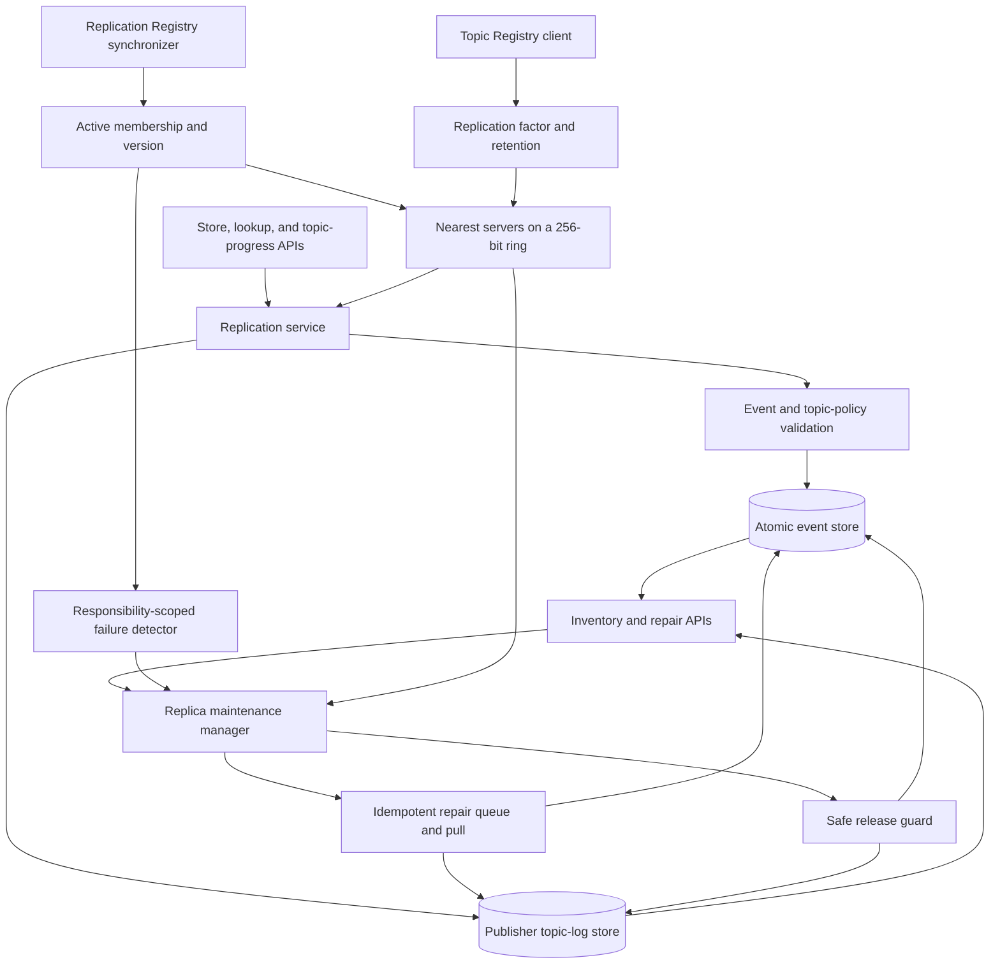

# D3 — Replication server internal architecture

Replication servers hold durable event copies and per-topic publisher progress.
Every server runs the same code; “entry,” “responsible,” and “surviving” describe
its role for a particular request or key, not different server types.

## How to read D3

A Pub/Sub node contacts any active server as an entry point. For a store request,
that server validates the event, hashes its event key, and selects the closest
`R` active server IDs on a 256-bit ring. It sends the event record to those
responsible servers. Publisher progress is stored separately in a topic log,
using the topic-log key and the topic's same replication factor.

Lookup is also brokered by the entry server. It calculates candidate servers and
tries them in deterministic order, so the caller does not need to know which
server owns a key. The event store and topic-log store are logically distinct
because recovery first discovers the latest sequence for each publisher and
then fetches the corresponding event keys.

The maintenance manager continuously observes membership, topic configuration,
peer health, and bounded peer inventories. When placement changes or a relevant
peer is confirmed unavailable, a newly responsible server pulls records from a
surviving source. Operations are idempotent, so repeated repair notifications
are safe.

## Safe release rule

Removal is deliberately conservative. A server deletes a now-obsolete local
copy only after every currently responsible target advertises an equivalent
record under the exact current membership fingerprint. A suspected failure or
stale inventory therefore causes extra copies to remain rather than risking
data loss.

The failure detector probes only peers relevant to records held locally. This
keeps detection responsibility distributed; there is no central repair leader.
