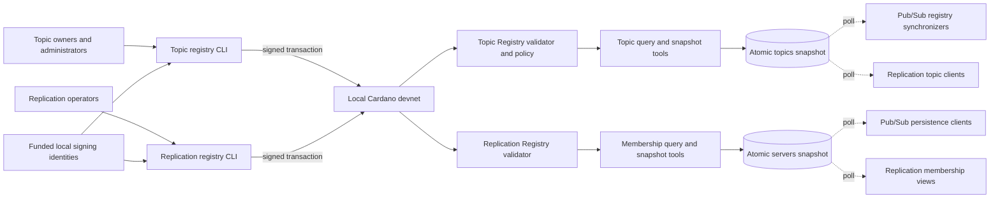
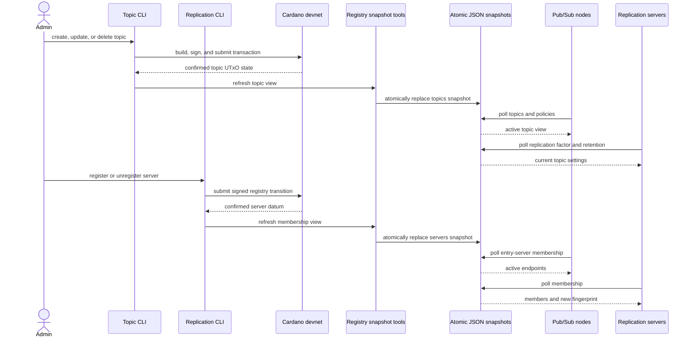

# D4 — Cardano and registry architecture

Cardano provides shared, auditable control-plane state. The local Java runtimes
do not query the chain for every operation; scripts materialize validated chain
state into atomic snapshots that can be polled cheaply.

## How to read D4

The left side shows who is authorized to change state. Topic owners use funded
signing identities for topic lifecycle and policy transactions. Replication
operators use their identities to register or unregister storage servers. The
validators enforce the allowed state transitions on the local Cardano ledger.

The right side is the bridge to the Java runtimes. Query tools read confirmed
UTxO state and replace complete JSON snapshots atomically, so a reader observes
either the old valid snapshot or the new valid snapshot—never a partially
written file. Pub/Sub nodes consume topic policies and server endpoints;
replication servers consume both topic policies and the active membership.

Event payloads and replica inventories are absent by design. Cardano records
governance and discovery data, while the data and persistence planes handle the
high-volume event path.

# D10 — Administrative actions and runtime observation

D10 expands D4 over time. It distinguishes an explicit administrative write
from the independent polling by long-running components.

## How to read D10

Each administrative operation has two stages: commit the authoritative change
on Cardano, then refresh the local read model. Runtimes discover the change on
their next polling cycle. The sequence therefore has an expected observation
delay; a successful transaction does not imply that every JVM has already
adopted the new view.

A topic update can change validation policy, retention, or replication factor.
A membership update can change entry-server selection and replica placement.
Those downstream reactions are shown in D2 and D3 rather than repeated here.
