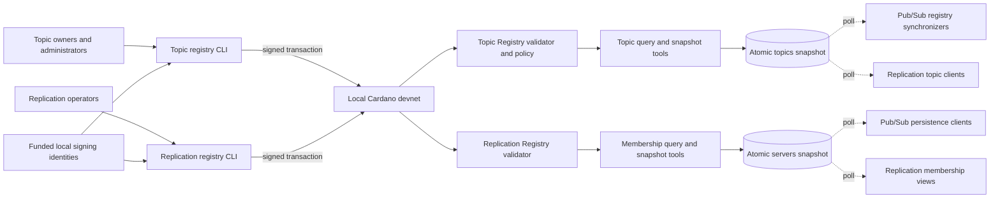
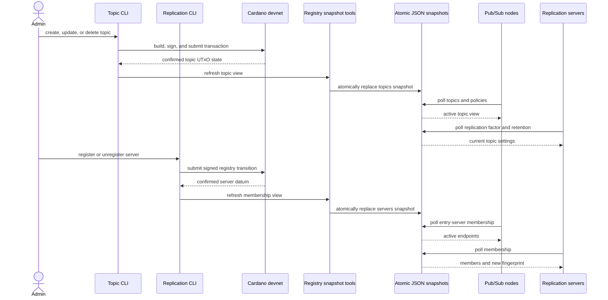

# D4 — Cardano and registry architecture

Cardano provides shared, auditable control-plane state. The local Java runtimes
do not query the chain for every operation; registry clients materialize
validated chain state into atomic snapshots that can be polled cheaply.


```mermaid
flowchart LR
  Owners[Topic owners and administrators] --> TopicCLI[Topic registry CLI]
  Operators[Replication operators] --> ReplCLI[Replication registry CLI]
  Identities[Funded local signing identities] --> TopicCLI
  Identities --> ReplCLI
  TopicCLI -->|signed transaction| Devnet[Local Cardano devnet]
  ReplCLI -->|signed transaction| Devnet
  Devnet --> TopicContract[Topic Registry validator and policy]
  Devnet --> ReplContract[Replication Registry validator]
  TopicContract --> TopicQuery[Topic query and snapshot tools]
  ReplContract --> ReplQuery[Membership query and snapshot tools]
  TopicQuery --> TopicCache[(Atomic topics snapshot)]
  ReplQuery --> ReplCache[(Atomic servers snapshot)]
  TopicCache -. poll .-> NodeSync[Pub/Sub registry synchronizers]
  TopicCache -. poll .-> ServerSync[Replication topic clients]
  ReplCache -. poll .-> NodeMembership[Pub/Sub persistence clients]
  ReplCache -. poll .-> ServerMembership[Replication membership views]
```

## How to read D4

The left side shows who is authorized to change state. Topic owners use funded
signing identities for topic lifecycle and policy transactions. Replication
operators use their identities to register or unregister storage servers. The
validators enforce the allowed state transitions on the local Cardano ledger.

The right side is the bridge to the Java runtimes. Registry clients read
confirmed UTxO state and replace complete JSON snapshots atomically, so a reader observes
either the old valid snapshot or the new valid snapshot—never a partially
written file. Pub/Sub nodes consume topic policies and server endpoints;
replication servers consume both topic policies and the active membership.

Event payloads and replica inventories are absent by design. Cardano records
governance and discovery data, while the data and persistence planes handle the
high-volume event path.

## Cardano CLI execution

The registry selects one command backend at construction time:

- `HOST` runs the installed `cardano-cli` and requires network magic and a node socket path.
- `DEVNET` runs `cardano-cli` through the devnet Docker Compose service and requires network magic.
- `CACHE_ONLY` disables commands and lets application runtimes consume the materialized registry cache.

Shared Java execution and payment-transaction types live under
`org.pubsub.prototype.cardano.cli`. The Topic Registry implementation lives
under `org.pubsub.prototype.registry.topic.cardano`; the separate Replication
Registry implementation lives under `org.pubsub.prototype.registry.replication.cardano`.
Each registry keeps its own deployment, datum, mutation, and transaction code.
The replication runtime consumes a persistence snapshot from
`org.pubsub.prototype.persistence`, without depending on the Cardano registry
implementation.

There is no automatic fallback between backends. Application YAML selects
`CACHE_ONLY`, while registry administration scripts select `DEVNET` by default.
Set `CARDANO_CLI_BACKEND=HOST` to make those scripts use an installed CLI
instead.

Deployment metadata and the configured signing identity are loaded lazily and
cached for the lifetime of a `CardanoTopicRegistry` instance. Changes to
`deployment.env`, the configured signer, its payment address or key files, the
network environment, or the CLI backend therefore require the owning process
to be restarted. On-chain topic changes remain dynamic and continue to be
observed through registry queries without a restart.

The configured signer is the only identity read from the local `keys/`
directory. Topic owner and administrator arguments cross the registry boundary
as public 56-character Cardano payment-key hashes; the owner supplies those
hashes through a separate trusted channel. The Java and shell boundaries reject
identity names for these fields. Local acceptance tests use
`scripts/registry/payment-key-hash.sh` only to derive hashes for generated
devnet identities.

For the complete generated command shapes, their purposes, and their owning
scripts or Java components, see the
[Cardano CLI command reference](../../documentation/cardano-cli.md).

The `DEVNET` backend expands a command to:

```text
docker compose \
  --env-file <devnet>/versions.env \
  -f <devnet>/compose.yaml \
  exec -T \
  -e CARDANO_NODE_SOCKET_PATH=/devnet/runtime/testnet/socket/node1/sock \
  cardano-node cardano-cli <arguments>
```

Paths inside `<arguments>` that belong to the host devnet directory are mapped
under the container's `/devnet` mount.

### Local Cardano pool node

The Docker devnet currently creates one Cardano pool node. This is the blockchain
process that validates transactions, maintains the test ledger, and produces
blocks; it is unrelated to the Pub/Sub application nodes. The CLI connects to it
through `/devnet/runtime/testnet/socket/node1/sock` inside the container. The
host devnet runtime directory is mounted at `/devnet/runtime`, so the same socket
is also available from the host through the generated network configuration.

One pool node is enough for contract and integration testing. A multi-pool devnet
would create additional node sockets, but the CLI could still use node 1 as its
single query and submission endpoint.

# D10 — Administrative actions and runtime observation

D10 expands D4 over time. It distinguishes an explicit administrative write
from the independent polling by long-running components.


```mermaid
sequenceDiagram
  actor Admin
  participant TopicCLI as Topic CLI
  participant ReplCLI as Replication CLI
  participant Chain as Cardano devnet
  participant Snapshot as Registry snapshot tools
  participant Cache as Atomic JSON snapshots
  participant Nodes as Pub/Sub nodes
  participant Servers as Replication servers

  Admin->>TopicCLI: create, update, or delete topic
  TopicCLI->>Chain: build, sign, and submit transaction
  Chain-->>TopicCLI: confirmed topic UTxO state
  TopicCLI->>Snapshot: refresh topic view
  Snapshot->>Cache: atomically replace topics snapshot
  Nodes->>Cache: poll topics and policies
  Cache-->>Nodes: active topic view
  Servers->>Cache: poll replication factor and retention
  Cache-->>Servers: current topic settings

  Admin->>ReplCLI: register or unregister server
  ReplCLI->>Chain: submit signed registry transition
  Chain-->>ReplCLI: confirmed server datum
  ReplCLI->>Snapshot: refresh membership view
  Snapshot->>Cache: atomically replace servers snapshot
  Nodes->>Cache: poll entry-server membership
  Cache-->>Nodes: active endpoints
  Servers->>Cache: poll membership
  Cache-->>Servers: members and new fingerprint
```

## How to read D10

Each administrative operation has two stages: commit the authoritative change
on Cardano, then refresh the local read model. Runtimes discover the change on
their next polling cycle. The sequence therefore has an expected observation
delay; a successful transaction does not imply that every JVM has already
adopted the new view.

A topic update can change validation policy, retention, or replication factor.
A membership update can change entry-server selection and replica placement.
Those downstream reactions are shown in D2 and D3 rather than repeated here.
