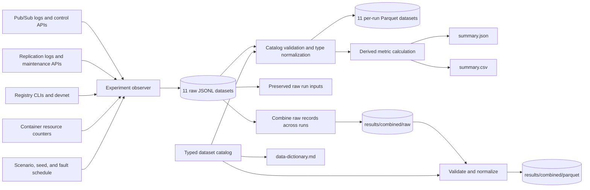
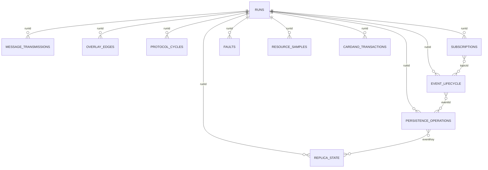

# D5 — Telemetry and results pipeline

This diagram explains how a live experiment becomes a reproducible dataset. The
key rule is that detailed raw observations are retained; summaries can always be
recomputed with different analysis choices.

## How to read D5

The experiment observer is a test harness, not a message broker. It drives the
scenario while sampling control APIs, collecting structured runtime logs,
reading Docker counters, and recording Cardano CLI activity. It correlates those
sources with one run identity and writes one JSON Lines file per dataset.

Raw JSONL is authoritative because it preserves individual observations.
Normalization checks required fields and types and produces Parquet for efficient
analysis. JSON and CSV summaries are conveniences, not substitutes for the raw
records. Cross-run aggregation concatenates compatible raw records and then
normalizes the combined data; it does not average away the underlying samples.

Every record includes run, scenario, repetition, seed, UTC time, and monotonic
time where applicable. Domain identifiers such as node ID, topic ID, event ID,
event key, and server ID connect observations across datasets.

## Logical data relationships

This is a join map for analysts, not a transactional database schema. The
cardinality symbols are intentionally optional because telemetry may observe one
side of an interaction without observing the other.

## How to read the relationship diagram

`RUNS` is the anchor: one run can have zero or many observations in every
specialized dataset. An event ID connects live lifecycle observations to store
or lookup activity. The deterministic event key connects persistence operations
to physical replica state. Topic ID connects subscription state to events that
could be delivered under that subscription.

These are analytical joins rather than enforced foreign keys. For example, a
rejected live event may have lifecycle observations but no persistence record,
and a maintenance inventory may contain a replica created before the observer's
current sampling window.
