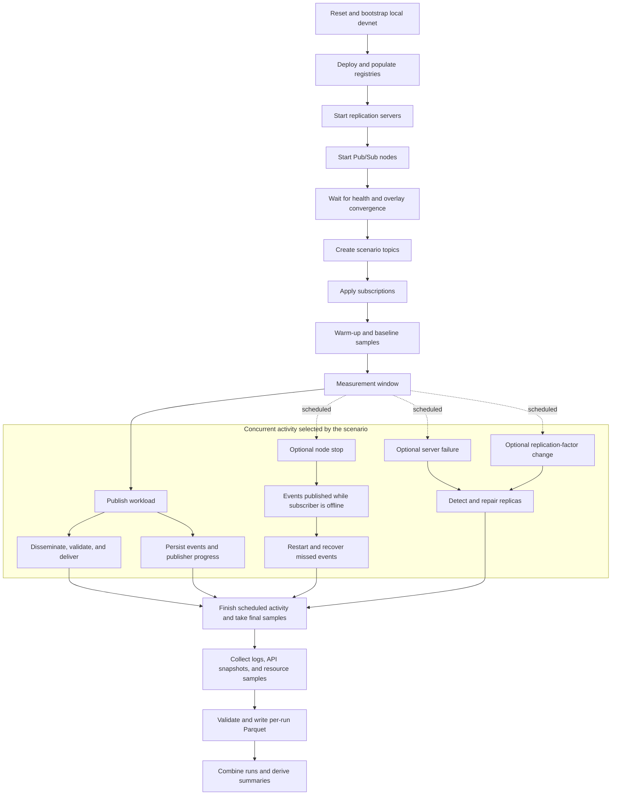
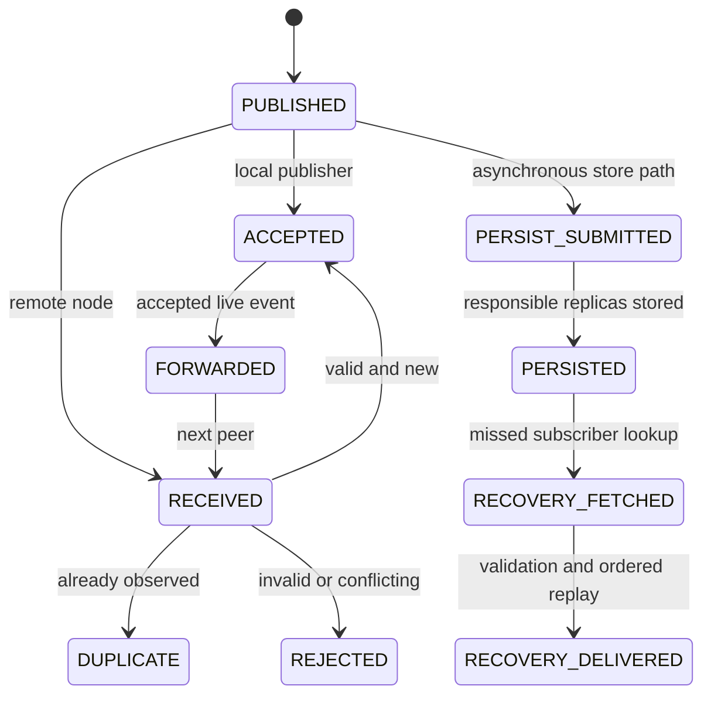

# D6 — Integrated time-progress flow

D6 is a lifecycle for an experiment run, not a claim that every scenario injects
every fault. The solid spine is common to all runs; the branches inside the
measurement window are selected by the scenario's workload and fault schedule.

## How to read D6

Setup is deliberately ordered: registry state exists before replication servers
start, and servers are healthy before Pub/Sub nodes begin using persistence.
After nodes converge, the controller creates topics, subscribes nodes, and waits
through a warm-up period so startup behavior is not confused with steady-state
measurement.

Publication, dissemination, and persistence overlap in real time. Fault actions
also run according to timestamps in the scenario rather than after the workload.
An offline-node branch creates missed events for recovery; a storage failure or
replication-factor change triggers maintenance. Scenarios without a particular
fault simply do not take that branch.

The controller waits for all scheduled actions—including recovery—to finish
before collecting final evidence. Normalization and aggregation happen after the
runtime observation window, so analysis work cannot affect protocol timing.

## Event lifecycle observations

This state diagram lists the telemetry stages that may be emitted for one event.
It is not one globally serialized state machine: live dissemination and
persistence proceed concurrently, and different nodes can observe different
stages at the same time.

## How to read the event lifecycle

`PUBLISHED` identifies event creation at the origin. The publisher accepts its
own valid event locally, starts dissemination, and independently schedules a
persistence submission. A remote node records `RECEIVED` before choosing exactly
one of accepted, duplicate, or rejected for that observation. An accepted live
event may then be forwarded to another peer, which starts its own receive path.

The persistence branch is independent of how many subscribers accept the live
event. Later, an offline subscriber can reconstruct a missing event key from the
stored topic log, fetch the persisted envelope, validate it, and record recovery
delivery. Not every event has every stage: an online subscriber needs no recovery,
and a rejected event is not persisted by a receiving peer.
