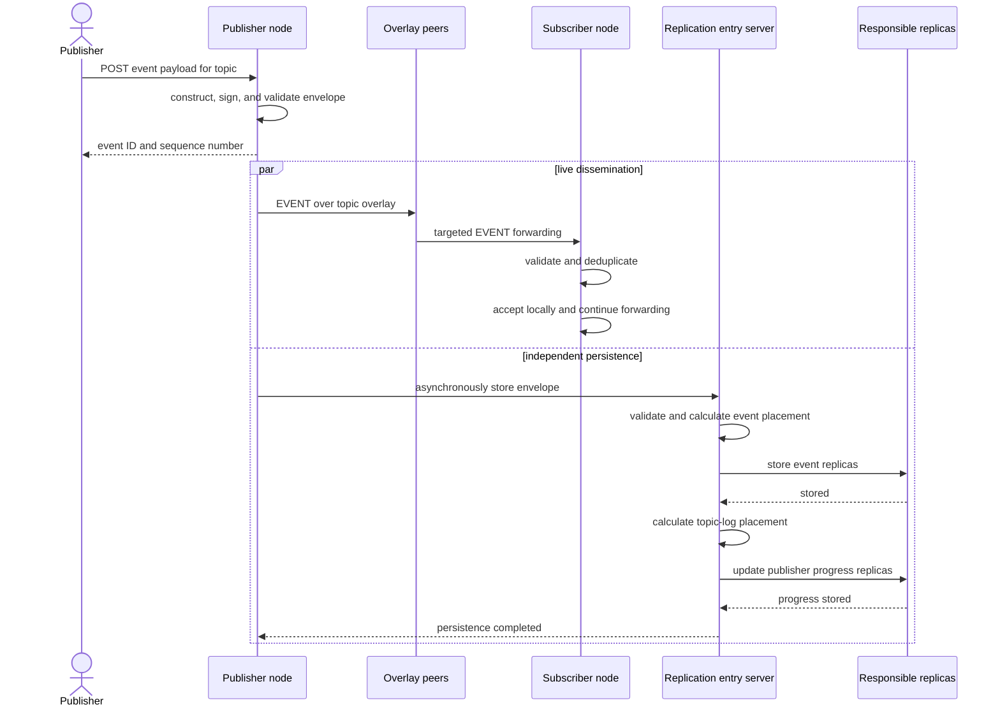
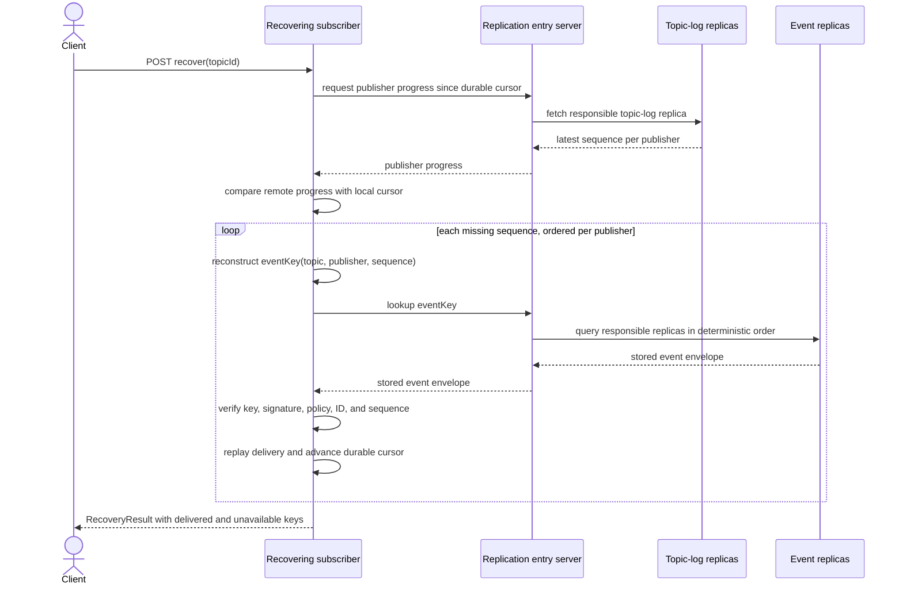
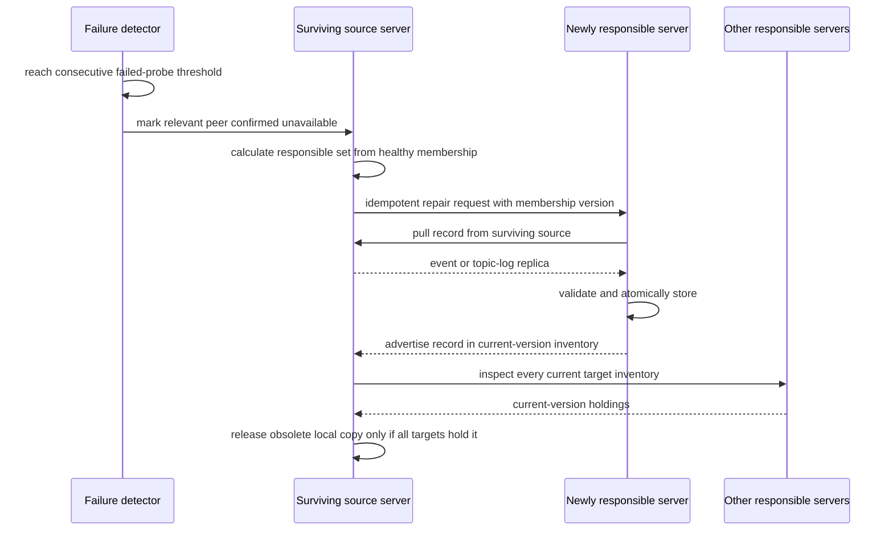

# D7 — Event publication and dissemination

D7 follows one valid event from an application through the two concurrent paths:
low-latency live dissemination and durable persistence for later recovery.

## How to read D7

The application gets its event identity from the publisher node; it does not
contact peers or storage servers directly. Live delivery uses the topic overlay.
Every receiving node validates the signature, topic policy, event identity, and
sequence before accepting, and duplicate suppression prevents overlay cycles
from causing duplicate application delivery.

Persistence starts asynchronously at the original publisher only. The first
replication server is an entry point: it determines the responsible set for the
event key and a potentially different responsible set for the topic-log key.
The plural “Responsible replicas” lifeline summarizes those server-to-server
writes. Live dissemination can succeed before persistence completes, or vice
versa; the two branches intentionally do not block each other.

# D8 — Offline recovery

D8 starts after a subscriber has been offline while newer events were published
and persisted. Recovery uses compact publisher progress first, then retrieves
only the missing event envelopes.

## How to read D8

The durable local cursor says how far this subscriber has delivered each
publisher's sequence for a topic. The entry server brokers both kinds of lookup;
topic-log and event replicas respond to it, not directly to the subscriber. This
lets the subscriber use any active entry server without knowing current DHT
placement.

Missing event keys are deterministic, so no global event index is needed. Fetches
may run concurrently, but delivery is ordered for each publisher. If a sequence
cannot be fetched or fails validation, recovery does not advance past the gap.
The result reports delivered keys separately from temporarily unavailable keys,
making partial recovery explicit and retryable.

# D9 — Replica repair

D9 shows the decentralized maintenance loop after a relevant storage peer is
confirmed unavailable or placement changes. The named participants are roles
inside ordinary replication-server processes, not separate services.

## How to read D9

Failure detection is scoped to servers relevant to locally held records. After
the configured number of failed probes, surviving servers exclude the failed
member from healthy placement and notify missing targets. The newly responsible
server pulls from a listed surviving source, validates the record, and stores it
atomically. Retried notifications or stores are safe.

Repair and release are intentionally asymmetric. Repair can begin as soon as a
record is missing from a responsible target. Release waits until all current
targets advertise the record under the same current membership version. If
evidence is missing or stale, the source retains its extra copy.
