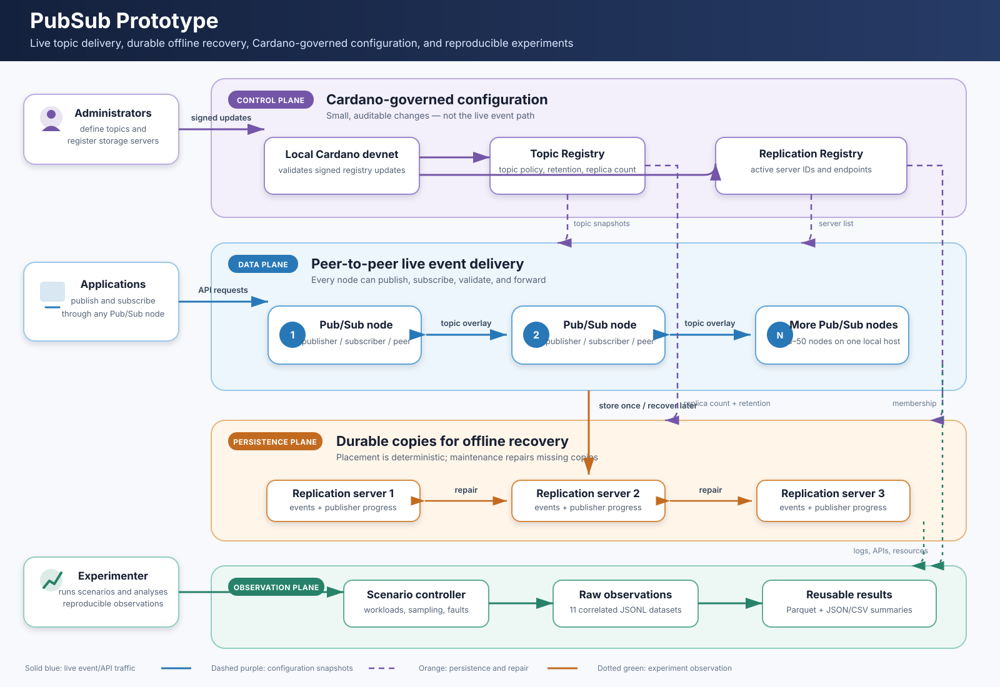

# Phase 0.9 architecture

These documents describe the integrated local prototype as implemented. Start
with the [large system overview](diagrams/system-overview.svg) if you are new to
the project, then use the numbered diagrams for implementation detail.

## The system in one minute

The prototype is a topic-based publish/subscribe network. Applications connect
to any Pub/Sub node to publish events, subscribe to topics, or recover events
missed while offline. Pub/Sub nodes form an overlay and forward live events to
interested peers.

Cardano is the **control plane**: its two registries describe topics and active
replication servers. Event payloads do not travel through Cardano. They are
copied to a separate set of replication servers so an offline subscriber can
recover them later. During experiments, a controller starts workloads and
faults, observes every plane, and writes reproducible datasets.

## Four-plane mental model

| Plane | Main question | Components |
| --- | --- | --- |
| Control | What topics and storage servers currently exist? | Local Cardano devnet, Topic Registry, Replication Registry |
| Data | How does a live event reach subscribers? | Pub/Sub nodes, SecureCyclon, Navigation, Dissemination, Netty transport |
| Persistence | Where can missed events be found later? | Replication entry APIs, deterministic placement, event and topic-log replicas |
| Observation | How do we reproduce and analyse a run? | Scenario runner, log/API/resource collector, JSONL, Parquet, summaries |

The planes cooperate but have different jobs. In particular, the control plane
does not carry event traffic, and the observation plane is testbed tooling rather
than part of the production message path.

## Diagram guide

| Document | Diagrams | Question answered |
| --- | --- | --- |
| [01-overall-system.md](01-overall-system.md) | D1 and local deployment | What runs, and how do the major planes connect? |
| [02-pubsub-node.md](02-pubsub-node.md) | D2 | What happens inside one Pub/Sub node? |
| [03-replication-server.md](03-replication-server.md) | D3 | How are durable copies placed, repaired, and released? |
| [04-cardano-registries.md](04-cardano-registries.md) | D4 and D10 | Who changes registry state, and how do runtimes observe it? |
| [05-telemetry-pipeline.md](05-telemetry-pipeline.md) | D5 and data relationships | How does a run become reusable analysis data? |
| [06-time-flows.md](06-time-flows.md) | D6 and event lifecycle | In what order does a run proceed, and what can happen to one event? |
| [07-sequence-diagrams.md](07-sequence-diagrams.md) | D7, D8, and D9 | Which component calls which during publication, recovery, and repair? |

## Reading conventions

- A solid arrow is an active call, message, or data transfer.
- A dashed arrow is polling, observation, or configuration propagation.
- A cylinder or database-shaped node is stored state.
- Boxes grouped inside a boundary run in the same logical plane or process.
- Sequence diagrams read from top to bottom. Flowcharts follow their arrows;
  physical placement alone does not imply call order.
- “Node” means a Pub/Sub JVM. “Server” means a replication-server JVM.
  A Pub/Sub node may publish and subscribe at the same time.
- “Entry server” is the first replication server contacted by a Pub/Sub node.
  It brokers placement and lookup; it is not necessarily a responsible replica.

## Local topology

The runtime topology is generated from `ops/config/phase-0.9/testbed.yaml`.
The generator accepts 3–50 Pub/Sub nodes and currently creates exactly three
replication servers. Host ports are `7000 + node index` for transport,
`8000 + node index` for node control APIs, and `8100 + server index` for
replication APIs. Container-to-container traffic uses ports 7000 and 8100.

All Mermaid source remains checked in for review and paper reuse. The standalone
SVG is intentionally larger and less technical, but it now labels each component
with its implementation module or protocol so it doubles as an onboarding map
from responsibilities to code. Open it directly for presentations or onboarding.
